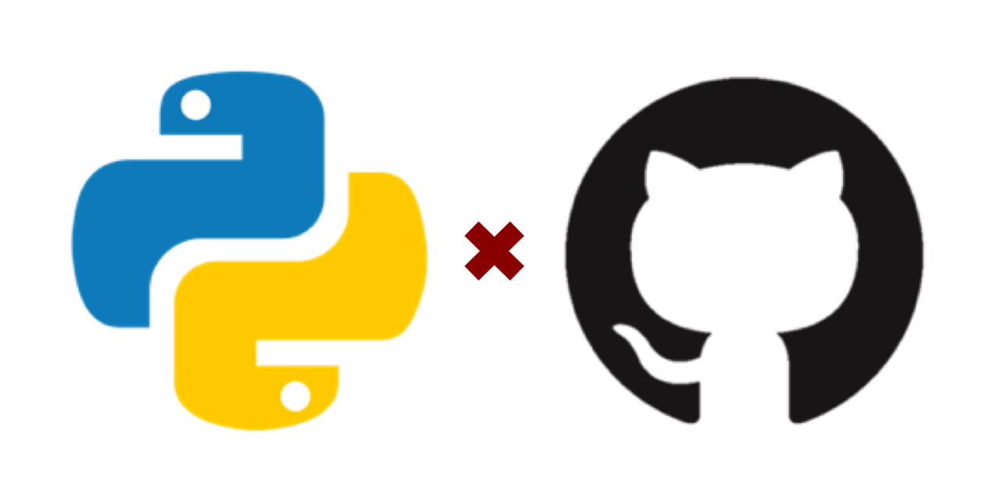

.. Arcade Dance System documentation master file, created by
   sphinx-quickstart on Sun Jul  3 02:08:26 2021.
   You can adapt this file completely to your liking, but it should at least
   contain the root `toctree` directive.

Welcome to {{ PACKAGE_NAME }}'s documentation!
===============================================

|header| |PyPI version| |GitHub version| |Execute Python package| |Upload Python Package| |license|

{{ DESCRIPTION }}

Contents
--------

.. toctree::
   :maxdepth: 5

   {{ MODULE_NAME }}

Indices and tables
------------------

* :ref:`genindex`
* :ref:`modindex`
* :ref:`search`

.. |PyPI version| image:: https://badge.fury.io/py/{{ REPOSITORY_NAME }}.svg
   :target: https://pypi.org/project/{{ REPOSITORY_NAME }}/
.. |GitHub version| image:: https://badge.fury.io/gh/{{ AUTHOR }}%2F{{ REPOSITORY_NAME }}.svg
   :target: {{ PROJECT_URL }}
.. |Execute Python package| image:: {{ PROJECT_URL }}/actions/workflows/execute_python_package.yml/badge.svg
   :target: {{ PROJECT_URL }}/actions/workflows/execute_python_package.yml
.. |Upload Python Package| image:: {{ PROJECT_URL }}/actions/workflows/upload_python_package.yml/badge.svg
   :target: {{ PROJECT_URL }}/actions/workflows/upload_python_package.yml
.. |license| image:: https://img.shields.io/github/license/mashape/apistatus.svg?maxAge=2592000
   :target: {{ PROJECT_URL }}/blob/master/LICENSE